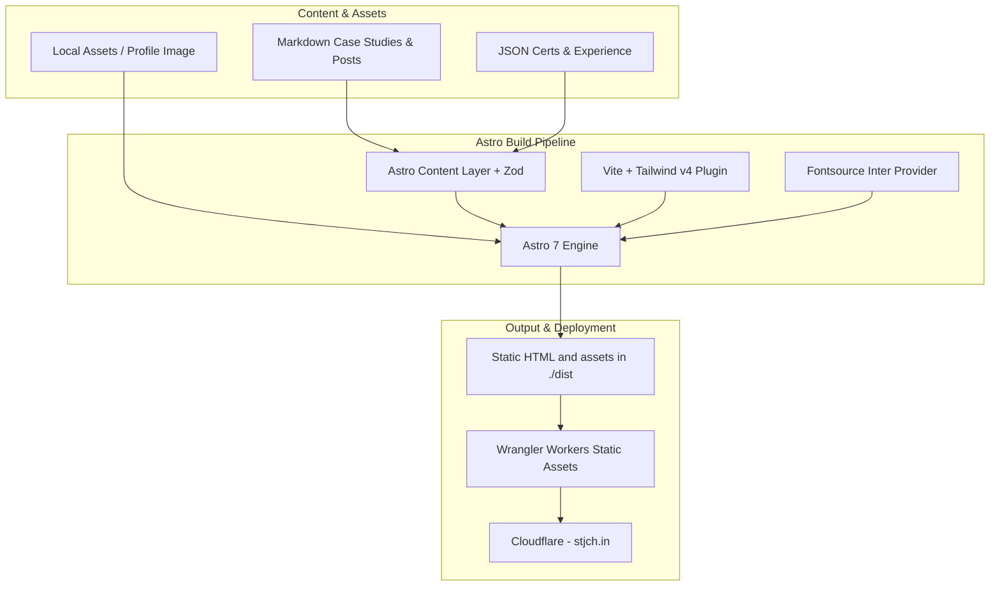

# 01 - Architecture Overview

This document details the high-level architecture, technology stack, directory organization, and configuration files of the portfolio website.

## High-Level System Architecture

The site is built with **Astro 7** and deployed to **Cloudflare** using `@astrojs/cloudflare` and Wrangler.



---

## Core Technology Stack

| Technology             | Version / Spec                  | Purpose                                                              |
| :--------------------- | :------------------------------ | :------------------------------------------------------------------- |
| **Astro**              | `^7.3.5`                        | Static site generation and web framework                             |
| **Wrangler**           | `^4.143.0`                      | Cloudflare CLI for local worker emulation and deployments            |
| **Tailwind CSS**       | `^4.3.3`                        | Utility-first styling via `@tailwindcss/vite`                        |
| **TypeScript**         | `^6.0.3`                        | Strict type checking across routes, components, and content schemas  |
| **Node.js types**      | `@types/node` `^26.6.4`         | Type definitions for Node globals used in Astro configuration        |
| **React**              | `^19.3.0`                       | `@astrojs/react` integration configured for UI islands when needed   |
| **Sitemap**            | `@astrojs/sitemap`              | Automated standard XML sitemap index generation                      |
| **RSS**                | `@astrojs/rss` `^4.0.19`        | Standards-compliant RSS 2.0 XML generation                           |
| **Fontsource**         | `fontProviders.fontsource()`    | Self-hosted Inter variable font assets via Astro's font provider     |

---

## Repository Structure

```text
.
├── docs/                       # Modular technical documentation
│   ├── README.md               # Documentation suite index
│   ├── 01-architecture-overview.md
│   ├── 02-content-collections.md
│   ├── 03-routing-and-pages.md
│   ├── 04-components-and-ui.md
│   ├── 05-styling-and-theming.md
│   └── 06-deployment-and-operations.md
├── public/                     # Public static files served at root
│   ├── apple-touch-icon.png
│   ├── favicon.ico
│   ├── favicon.svg
│   └── robots.txt
├── src/
│   ├── assets/                 # Processed media assets
│   │   └── images/             # Profile portraits and illustrations
│   ├── components/             # Reusable Astro UI components
│   │   ├── about/              # About page modular items (skills, academic)
│   │   ├── blog/               # Blog item components (BlogPostRow)
│   │   ├── certs/              # Cert list components (CertTable)
│   │   ├── common/             # Cross-cutting UI components (CertCard, Portrait, ProjectCard, ResumeButton)
│   │   ├── home/               # Homepage sections (hero, metrics, work, posts)
│   │   ├── layout/             # Container, SiteHeader, SiteFooter, PageHeader
│   │   └── theme/              # Theme system (ThemeProvider, ThemeToggle)
│   ├── content/                # Content source files
│   │   ├── blog/               # Technical blog posts in Markdown
│   │   ├── certs/              # Certifications JSON
│   │   ├── experience/         # Experience JSON
│   │   └── work/               # Featured work case studies in Markdown
│   ├── data/                   # Static structured data (competencies, publications)
│   ├── layouts/
│   │   └── BaseLayout.astro    # Common document layout with metadata
│   ├── lib/                    # Shared utilities (dates, schemas, collections)
│   ├── pages/                  # Route entry points
│   │   ├── blog/               # /blog and /blog/[id]
│   │   ├── work/               # /work and /work/[id]
│   │   ├── 404.astro           # Custom 404 page
│   │   ├── about.astro         # /about page
│   │   ├── certs.astro         # /certs page
│   │   ├── index.astro         # Homepage (/)
│   │   └── rss.xml.ts          # RSS feed endpoint
│   ├── styles/
│   │   └── global.css          # Tailwind imports, design tokens, custom variant
│   ├── types/                  # Shared TypeScript type definitions
│   └── content.config.ts       # Astro Content Layer definitions and schemas
├── astro.config.mjs            # Astro project configuration
├── package.json                # Dependencies and npm scripts
├── tsconfig.json               # TypeScript compiler configuration & aliases
├── wrangler.jsonc              # Cloudflare Worker and asset configuration
└── worker-configuration.d.ts   # Cloudflare Worker environment type definitions
```

---

## Path Aliases

TypeScript path aliases are configured in `tsconfig.json` and resolve seamlessly in Vite and Astro:

| Alias           | Target Path        | Usage Example                                                     |
| :-------------- | :----------------- | :---------------------------------------------------------------- |
| `@components/*` | `src/components/*` | `import ProjectCard from "@components/common/ProjectCard.astro";` |
| `@layouts/*`    | `src/layouts/*`    | `import BaseLayout from "@layouts/BaseLayout.astro";`             |
| `@assets/*`     | `src/assets/*`     | `import profileImage from "@assets/images/profile.png";`          |
| `@styles/*`     | `src/styles/*`     | `import "@styles/global.css";`                                    |
| `@lib/*`        | `src/lib/*`        | `import { getSortedPosts } from "@lib/collections";`              |
| `@types`        | `src/types/index.ts`| `import type { BlogEntry } from "@types";`                       |
| `@types/*`      | `src/types/*`      | `import type { BlogEntry } from "@types";`                        |
| `@data/*`       | `src/data/*`       | `import skills from "@data/competencies.json";`                   |
| `@content/*`    | `src/content/*`    | `import certsData from "@content/certs/certs.json";`              |

---

## Key Configurations

### `astro.config.mjs`

```javascript
import { defineConfig, fontProviders } from "astro/config";
import react from "@astrojs/react";
import markdoc from "@astrojs/markdoc";
import keystatic from "@keystatic/astro";
import sitemap from "@astrojs/sitemap";
import tailwindcss from "@tailwindcss/vite";

const isDev = process.argv.includes("dev");

export default defineConfig({
  trailingSlash: "never",
  integrations: [
    react(),
    markdoc(),
    sitemap({
      filter: (page) => !page.includes('/keystatic'),
    }),
    ...(isDev ? [keystatic()] : []),
  ],
  site: "https://stjch.in",
  session: false,
  prefetch: { prefetchAll: true },
  vite: { plugins: [tailwindcss()] },
  fonts: [{
    provider: fontProviders.fontsource(),
    name: "Inter",
    cssVariable: "--font-sans",
  }],
});
```

### Highlights:

- Astro's default `output: "static"` prerenders the site into `./dist`; no Astro Cloudflare adapter or SSR runtime is configured.
- Wrangler publishes `./dist` through Cloudflare Workers Static Assets.
- `trailingSlash: 'never'`: Normalizes canonical URLs across all pages.
- `prefetchAll: true`: Accelerates client navigation by automatically prefetching links.
- `@astrojs/sitemap`: Generates `/sitemap-index.xml` automatically from prerendered static routes; canonicals use `https://stjch.in`.
- `session: false`: Explicitly disables session middleware for lean static delivery.

---

## Next Steps

- Proceed to [02 - Content Collections](./02-content-collections.md) to inspect data modeling and schemas.
- Proceed to [03 - Routing and Pages](./03-routing-and-pages.md) for page implementation details.
