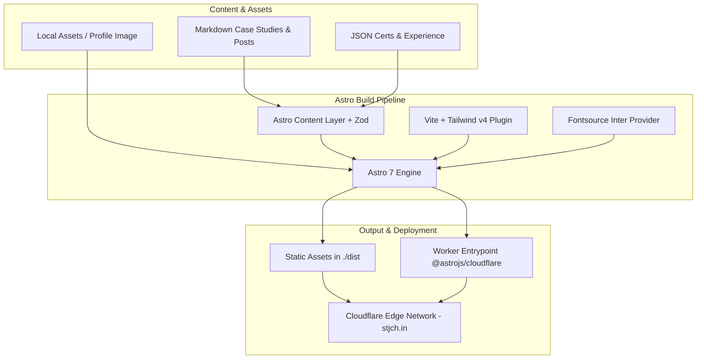

# 01 - Architecture Overview

This document details the high-level architecture, technology stack, directory organization, and configuration files of the portfolio website.

## High-Level System Architecture

The site is built with **Astro 7** and deployed to **Cloudflare** using `@astrojs/cloudflare` and Wrangler.



---

## Core Technology Stack

| Technology             | Version / Spec                  | Purpose                                                             |
| :--------------------- | :------------------------------ | :------------------------------------------------------------------ |
| **Astro**              | `^7.3.5`                        | Static site generation and web framework                            |
| **Cloudflare Adapter** | `@astrojs/cloudflare` `^14.3.3` | Cloudflare Workers/Pages edge deployment target                     |
| **Wrangler**           | `^4.143.0`                      | Cloudflare CLI for local worker emulation and deployments           |
| **Tailwind CSS**       | `^4.3.3`                        | Utility-first styling via `@tailwindcss/vite`                       |
| **TypeScript**         | `^6.0.3`                        | Strict type checking across routes, components, and content schemas |
| **React**              | `^19.3.0`                       | `@astrojs/react` integration configured for UI islands when needed  |
| **Sitemap**            | `@astrojs/sitemap` `^3.7.4`     | Automated sitemap generation at build time                          |
| **RSS**                | `@astrojs/rss` `^4.0.19`        | Standards-compliant RSS 2.0 XML generation                          |
| **Fontsource**         | `@fontsource-variable/inter`    | Self-hosted Inter variable font via Astro font provider             |

---

## Repository Structure

```text
.
├── docs/                       # Modular technical documentation
│   ├── README.md               # Documentation suite index
│   ├── 01-architecture-overview.md
│   ├── 02-content-collections.md
│   ├── 03-routing-and-pages.md
│   ├── 04-components-and-ui.md
│   ├── 05-styling-and-theming.md
│   └── 06-deployment-and-operations.md
├── public/                     # Public static files served at root
│   ├── favicon.ico
│   ├── favicon.svg
│   ├── robots.txt
│   └── satyatulasijalandharch.png
├── src/
│   ├── assets/                 # Processed media assets
│   │   └── images/             # Profile portraits and illustrations
│   ├── components/             # Reusable Astro UI components
│   │   ├── about/              # About page modular items (skills, academic)
│   │   ├── home/               # Homepage sections (hero, metrics, work, posts)
│   │   ├── layout/             # Container, SiteHeader, SiteFooter
│   │   ├── CertCard.astro      # Certification row card
│   │   ├── Portrait.astro      # Optimized profile image wrapper
│   │   ├── ProjectCard.astro   # Work case study card
│   │   ├── ResumeButton.astro  # Configurable resume button
│   │   ├── ThemeProvider.astro # FOUC-prevention head script
│   │   └── ThemeToggle.astro   # Tri-state theme switcher button
│   ├── content/                # Content source files
│   │   ├── blog/               # Technical blog posts in Markdown
│   │   ├── certs/              # certs.json
│   │   ├── experience/         # experience.json
│   │   └── work/               # Featured work case studies in Markdown
│   ├── layouts/
│   │   └── BaseLayout.astro    # Common document layout with metadata
│   ├── pages/                  # Route entry points
│   │   ├── blog/               # /blog and /blog/[id]
│   │   ├── work/               # /work and /work/[id]
│   │   ├── 404.astro           # Custom 404 page
│   │   ├── about.astro         # /about page
│   │   ├── certs.astro         # /certs page
│   │   ├── index.astro         # Homepage (/)
│   │   └── rss.xml.ts          # RSS feed endpoint
│   ├── styles/
│   │   └── global.css          # Tailwind imports, design tokens, custom variant
│   └── content.config.ts       # Astro Content Layer definitions and schemas
├── astro.config.mjs            # Astro project configuration
├── package.json                # Dependencies and npm scripts
├── tsconfig.json               # TypeScript compiler configuration & aliases
├── wrangler.jsonc              # Cloudflare Worker and asset configuration
└── worker-configuration.d.ts   # Cloudflare Worker environment type definitions
```

---

## Path Aliases

TypeScript path aliases are configured in `tsconfig.json` and resolve seamlessly in Vite and Astro:

| Alias           | Target Path        | Usage Example                                              |
| :-------------- | :----------------- | :--------------------------------------------------------- |
| `@components/*` | `src/components/*` | `import ProjectCard from "@components/ProjectCard.astro";` |
| `@layouts/*`    | `src/layouts/*`    | `import BaseLayout from "@layouts/BaseLayout.astro";`      |
| `@assets/*`     | `src/assets/*`     | `import profileImage from "@assets/images/profile.png";`   |
| `@styles/*`     | `src/styles/*`     | `import "@styles/global.css";`                             |
| `@content/*`    | `src/content/*`    | `import certsData from "@content/certs/certs.json";`       |

---

## Key Configurations

### `astro.config.mjs`

```javascript
import { defineConfig, fontProviders } from "astro/config";
import cloudflare from "@astrojs/cloudflare";
import react from "@astrojs/react";
import sitemap from "@astrojs/sitemap";
import tailwindcss from "@tailwindcss/vite";

export default defineConfig({
  site: "https://stjch.in",
  trailingSlash: "never",
  adapter: cloudflare(),
  integrations: [react(), sitemap()],
  vite: {
    plugins: [tailwindcss()],
  },
  redirects: {
    "/sitemap.xml": "/sitemap-index.xml",
  },
  prefetch: {
    prefetchAll: true,
  },
  session: false,
  fonts: [
    {
      name: "Inter",
      provider: fontProviders.fontsource(),
      css: [
        {
          src: "@fontsource-variable/inter/index.css",
        },
      ],
      fallback: "sans-serif",
    },
  ],
});
```

### Highlights:

- `adapter: cloudflare()`: Enables deployment to Cloudflare runtime.
- `trailingSlash: 'never'`: Normalizes canonical URLs across all pages.
- `prefetchAll: true`: Accelerates client navigation by automatically prefetching links.
- `redirects`: Maps `/sitemap.xml` to Astro's generated `/sitemap-index.xml`.
- `session: false`: Explicitly disables session middleware for lean static delivery.

---

## Next Steps

- Proceed to [02 - Content Collections](./02-content-collections.md) to inspect data modeling and schemas.
- Proceed to [03 - Routing and Pages](./03-routing-and-pages.md) for page implementation details.
