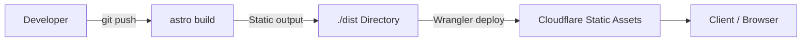

# 06 - Deployment and Operations

This document covers static site deployment to Cloudflare, `wrangler.jsonc` configuration, DNS routing, and operations workflows.

## Deployment Architecture

The application is built as a static Astro site and deployed to **Cloudflare Workers Static Assets** with **Wrangler**:



- **Static output**: HTML, CSS, JavaScript chunks, optimized images, and sitemaps are built into `./dist`.
- **No SSR runtime**: The deployment has no Astro Cloudflare adapter or Worker script. Wrangler publishes the static assets directly.

---

## Wrangler Configuration (`wrangler.jsonc`)

The runtime and edge infrastructure are defined in `wrangler.jsonc`:

```jsonc
{
  "$schema": "node_modules/wrangler/config-schema.json",
  "name": "satyatulasijalandharch",
  "compatibility_date": "2026-09-26",
  "compatibility_flags": ["global_fetch_strictly_public"],
  "assets": {
    "directory": "./dist",
    "html_handling": "drop-trailing-slash",
    "not_found_handling": "404-page",
  },
  "routes": [
    {
      "pattern": "stjch.in",
      "custom_domain": true,
    },
    {
      "pattern": "www.stjch.in",
      "custom_domain": true,
    },
  ],
  "observability": {
    "enabled": true,
    "head_sampling_rate": 1,
    "logs": {
      "enabled": true,
      "head_sampling_rate": 1,
      "invocation_logs": true,
    },
    "traces": {
      "enabled": true,
      "head_sampling_rate": 1,
    },
  },
  "preview_urls": true,
  "workers_dev": true,
}
```

### Key Directives:

- `compatibility_date`: Fixed compatibility target (`2026-09-26`).
- `assets.directory`: Publishes the static site generated in `./dist`.
- `assets.html_handling: "drop-trailing-slash"`: Matches Astro's `trailingSlash: 'never'` setting.
- `assets.not_found_handling: "404-page"`: Automatically routes 404 responses to `./dist/404.html`.
- `routes`: Binds production custom domains `stjch.in` and `www.stjch.in`.
- `observability`: Full invocation logs and distributed request tracing enabled in Cloudflare dashboard.

---

## NPM Scripts & Operational Workflows

Project commands are configured in `package.json`:

```json
"scripts": {
  "astro": "astro",
  "dev": "astro dev",
  "check": "astro check",
  "build": "astro build",
  "preview": "astro preview"
}
```

### 1. Local Development

```bash
# Start the Astro development server
npm run dev
```

### 2. Code Quality & Verification

```bash
# Validates TypeScript types and Astro component syntax
npm run check
```

### 3. Cloudflare Deployment

The GitHub Actions workflow runs `npm run build`, then deploys the `./dist` assets through Wrangler.

---

## Local Keystatic Authoring

The Keystatic Admin UI uses local filesystem storage and is available only during development. Run `npm run dev` and open `http://localhost:4321/keystatic`. Astro uses Node.js locally, which Keystatic needs for filesystem APIs. Production builds do not register Keystatic, so the deployed site does not expose a local-storage editor.

Keystatic changes files under `src/content/`. Review and commit those files to publish content through the existing GitHub Actions deployment workflow. Production editing is not configured; it would require a separate storage and hosting decision.

---

## Cloudflare DNS & Custom Domains

The site is provisioned with Cloudflare custom domains:

- Apex: `stjch.in`
- Subdomain: `www.stjch.in`

Both routes map to the Cloudflare Worker target. SSL/TLS is handled automatically at Cloudflare edge nodes with HSTS and HTTP/2 + HTTP/3 support.
