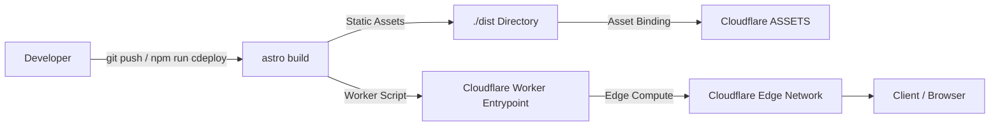

# 06 - Deployment and Operations

This document covers Cloudflare edge runtime integration, `wrangler.jsonc` configuration, DNS routing, and operations workflows.

## Deployment Architecture

The application is deployed to **Cloudflare** using `@astrojs/cloudflare` in combination with **Wrangler**:



- **Static Assets**: HTML, CSS, JavaScript chunks, optimized images, and sitemaps are built into `./dist` and served through Cloudflare Workers Assets.
- **SSR/Worker Runtime**: `@astrojs/cloudflare/entrypoints/server` acts as the edge entry point.

---

## Wrangler Configuration (`wrangler.jsonc`)

The runtime and edge infrastructure are defined in `wrangler.jsonc`:

```jsonc
{
  "$schema": "node_modules/wrangler/config-schema.json",
  "name": "satyatulasijalandharch",
  "main": "@astrojs/cloudflare/entrypoints/server",
  "compatibility_date": "2026-09-26",
  "compatibility_flags": ["global_fetch_strictly_public"],
  "assets": {
    "directory": "./dist",
    "binding": "ASSETS",
    "html_handling": "drop-trailing-slash",
    "not_found_handling": "404-page",
  },
  "routes": [
    {
      "pattern": "stjch.in",
      "custom_domain": true,
    },
    {
      "pattern": "www.stjch.in",
      "custom_domain": true,
    },
  ],
  "observability": {
    "enabled": true,
    "head_sampling_rate": 1,
    "logs": {
      "enabled": true,
      "head_sampling_rate": 1,
      "invocation_logs": true,
    },
    "traces": {
      "enabled": true,
      "head_sampling_rate": 1,
    },
  },
  "preview_urls": true,
  "workers_dev": true,
}
```

### Key Directives:

- `main`: Edge handler provided by `@astrojs/cloudflare/entrypoints/server`.
- `compatibility_date`: Fixed compatibility target (`2026-09-26`).
- `assets.binding`: Binds the `./dist` folder to Cloudflare's static asset pipeline.
- `assets.html_handling: "drop-trailing-slash"`: Matches Astro's `trailingSlash: 'never'` setting.
- `assets.not_found_handling: "404-page"`: Automatically routes 404 responses to `./dist/404.html`.
- `routes`: Binds production custom domains `stjch.in` and `www.stjch.in`.
- `observability`: Full invocation logs and distributed request tracing enabled in Cloudflare dashboard.

---

## NPM Scripts & Operational Workflows

All operational commands are configured in `package.json`:

```json
"scripts": {
  "astro": "astro",
  "dev": "astro dev --host",
  "check": "astro check",
  "build": "astro build",
  "preview": "astro preview",
  "generate-types": "wrangler types",
  "cdev": "astro build && npx wrangler dev",
  "cdeploy": "astro build && npx wrangler deploy"
}
```

### 1. Local Development

```bash
# Standard Astro dev server with network host access
npm run dev
```

### 2. Code Quality & Verification

```bash
# Validates TypeScript types and Astro component syntax
npm run check
```

### 3. Edge Emulation with Wrangler

```bash
# Builds project and simulates Cloudflare Worker environment locally
npm run cdev
```

### 4. Direct Cloudflare Deployment

```bash
# Builds the production bundle and deploys directly to Cloudflare
npm run cdeploy
```

### 5. Type Generation for Cloudflare Bindings

```bash
# Regenerates worker-configuration.d.ts from wrangler.jsonc
npm run generate-types
```

---

## Cloudflare DNS & Custom Domains

The site is provisioned with Cloudflare custom domains:

- Apex: `stjch.in`
- Subdomain: `www.stjch.in`

Both routes map to the Cloudflare Worker target. SSL/TLS is handled automatically at Cloudflare edge nodes with HSTS and HTTP/2 + HTTP/3 support.
